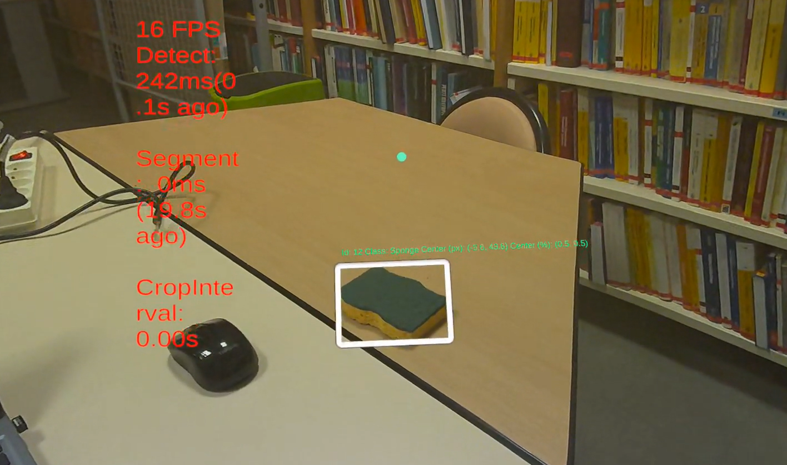
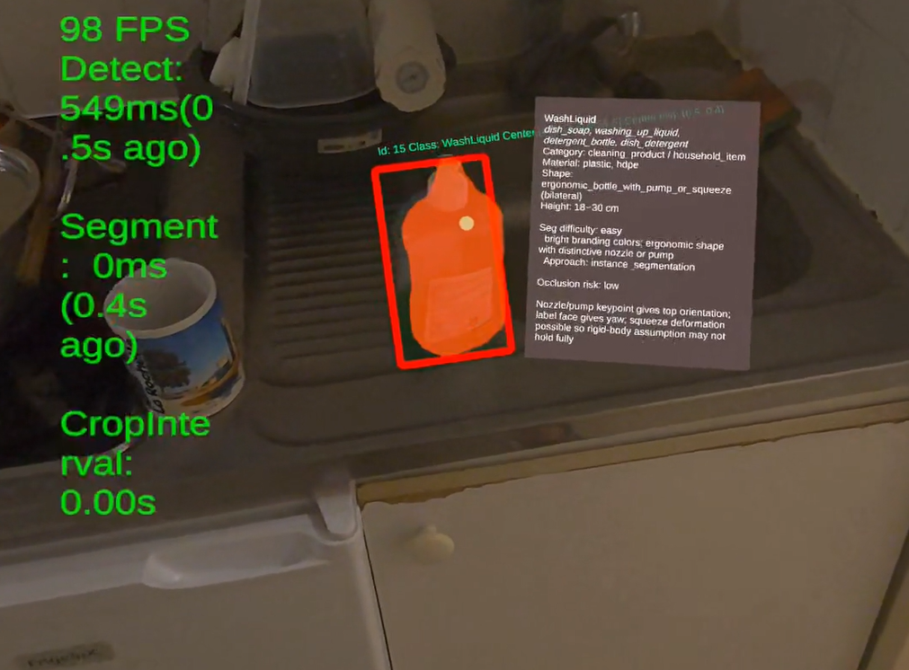

This project was made during my internship at the MIA laboratory at La Rochelle, France. Further information can be found in the report of this repo. 
- The 'Internship Report' is the report used for my internship defense, at the moment of submission.
- The 'Report (Extra)' provides some more explanation of the code and covers things I have done towards the end of my internship (after the internship defense).

This repo contains 2 submodules
- : some python scripts for preparing, training and testing the DL models used for the project
- : the Unity app that uses the given DL models to execute my pipeline.

## Demo

Click on an image to watch the demo video:

| Sponge | WashLiquid |
|:-------------:|:--------------------:|
| [](Demo/demo_sponge.mp4) | [](Demo/demo_washLiquid.mp4) |

## Installation

```
git lfs install
git clone --recurse-submodules https://github.com/NguyenHoangNhat-git/Segmentation-Pipeline-on-Meta-Quest-3.git
```